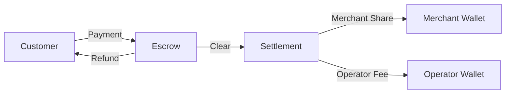

# Solana Commerce Program

A Solana-based payment processing system that enables secure, escrow-based transactions with 3rd party fee distribution and comprehensive payment lifecycle management.


#### Program ID

```
commkU28d52cwo2Ma3Marxz4Qr9REtfJtuUfqnDnbhT
```

## Overview

The Solana Commerce Program provides a decentralized payment infrastructure that handles the complete payment lifecycle from customer initiation to merchant settlement. 

### Key Features

- **Escrow-Based Payments** - Secure fund holding until payment clearance
- **Flexible Fee Structure** - Support for fixed fees or basis point percentages
- **Multi-Token Support** - Accept payments in various SPL tokens (USDC, USDT, etc.)
- **Policy Management** - Configurable refund, chargeback, and settlement rules
- **Complete Lifecycle** - Handles payments from creation to settlement and closure
- **High Performance** - Built with Pinocchio for optimal efficiency

## Documentation

### Account Types

1. **Merchant** - Business entities that receive payments
2. **Operator** - Service providers that process payments and collect fees  
3. **MerchantOperatorConfig** - Defines relationship, fees, and policies
4. **Payment** - Individual payment transactions with state management

### Payment Flow



For detailed program specifications, instruction references, and account structures, see:
- [**Program Overview**](docs/PROGRAM_OVERVIEW.md) - Complete technical documentation
- [**Use Solana Commerce with a Paymaster**](kora/README.md) - Host a Kora node to your Operator can cover Solana gas and account rent
<!-- - [**Integration Guide**](docs/guides/INTEGRATION.md) - Step-by-step TypeScript tutorial
- [**Payment Flow Diagram**](docs/DIAGRAM.md) - Visual representation of payment states
 -->
## Local Development Quick Start

### Project Structure

```
commerce-program/
├── program/                # Core Solana program (Rust)
│   ├── src/
│   │   ├── processor/      # Instruction handlers
│   │   ├── state/          # Account structures
│   │   ├── entrypoint.rs   # Program entrypoint
│   │   └── lib.rs          # Program library
├── clients/
│   ├── rust/               # Rust client SDK
│   └── typescript/         # TypeScript client SDK
│           └── tests/      # Client test suite
├── scripts/                # Build and generation scripts
├── idl/                    # IDL generated by Shank
├── docs/                   # Documentation
├── tests/                  # Program Integration tests
└── kora/                   # Docker image for implementing Kora paymaster (gasless relayer) as an operator for the commerce program
```

### Prerequisites

- [Solana CLI](https://docs.anza.xyz/cli/install) 2.2.1+
- [Rust](https://www.rust-lang.org/tools/install) 1.87+
- [Node.js](https://nodejs.org/) LTS
- [Bun](https://bun.sh/)
- [Shank CLI](https://github.com/metaplex-foundation/shank) (for IDL generation)

### Installation

```bash
# Clone the repository
git clone https://github.com/your-org/commerce-program.git
cd commerce-program

# Install dependencies
make install

# Build the program
make build
```

### Building

```bash
# Build program only
cargo build --release

# Build with IDL and client generation
make build
```

### Testing

```bash
# Run unit tests
make test

# Run integration tests (includes setup)
make test-integration

# Run all tests
make test-all
```

### Client Generation

The project uses [Shank](https://github.com/metaplex-foundation/shank) for IDL generation and [Codama](https://github.com/codama-idl/codama) for client generation. These are automatically run when you run `make build`. You can also run them manually:

```bash
# Generate IDL from program annotations
make generate-idl

# Generate TypeScript and Rust clients
make generate-clients
```

### Local Development

The program enables USDC and USDT payments by default. To use the program on local host you will need to start your local validator with the mints for USDC and USDT. 

The following command will start a local validator with the mints for USDC and USDT and the program deployed to it.

```bash
# Start local validator
solana-test-validator -r \
    --account EPjFWdd5AufqSSqeM2qN1xzybapC8G4wEGGkZwyTDt1v tests/setup/mints/usdc.json \
    --account Es9vMFrzaCERmJfrF4H2FYD4KCoNkY11McCe8BenwNYB tests/setup/mints/usdt.json \
    --bpf-program commkU28d52cwo2Ma3Marxz4Qr9REtfJtuUfqnDnbhT target/deploy/commerce_program.so
```

### Devnet Deployment

```bash
# Build with devnet features
make build-devnet

# Deploy (requires funded deployer keypair)
make deploy-devnet DEPLOYER_KEY=/path/to/deployer.json
```

## Contributing

We welcome contributions! Please open an issue or pull request.

## Tech Stack

- Built with [Pinocchio](https://github.com/anza-xyz/pinocchio) for optimal performance
- Uses [Shank](https://github.com/metaplex-foundation/shank) for IDL generation
- Client generation powered by [Codama](https://github.com/codama-idl/codama)
- Tested with [LiteSVM](https://github.com/LiteSVM/litesvm)
- Client testing/examples with [Gill](https://github.com/DecalLabs/gill)