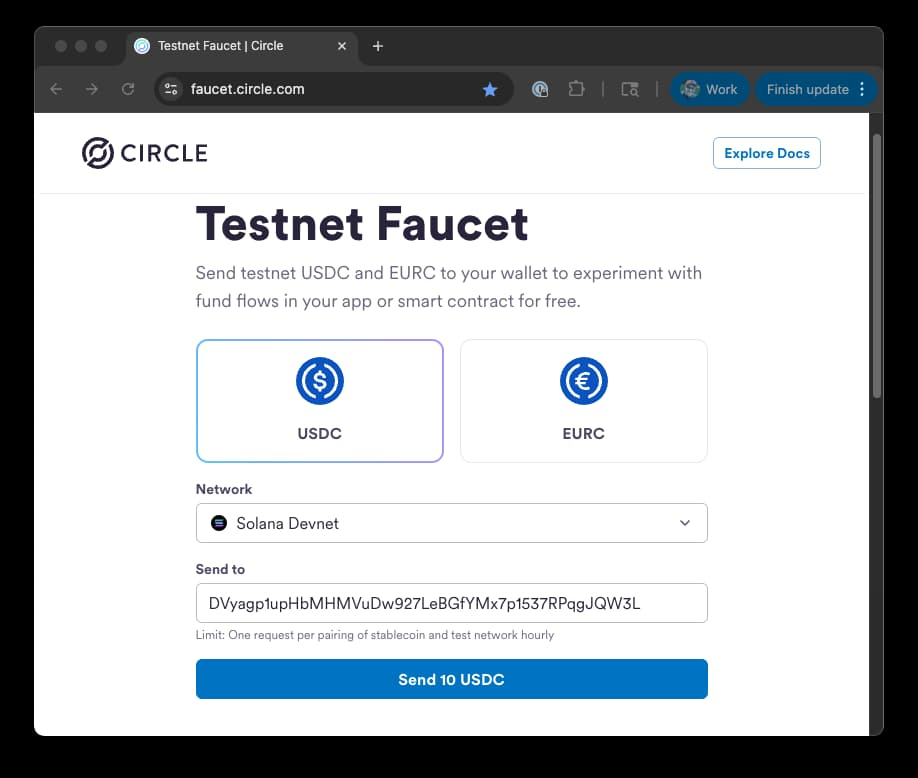

# How to Build a Commerce Payment System on Solana (TypeScript)

## What is the Solana Commerce Program?

The Solana Commerce Program is an on-chain payment processing system that enables secure, payment flows transactions between merchant, operators, and customers . Think of it as a decentralized payment processor that handles the complete payment lifecycle from initiation to settlement.

The program provides capabilities for:

* **Merchant Management** - Create and manage merchant accounts with settlement wallets
* **Operator Services** - Payment processing operators that handle transactions and collect fees (and optionally cover transaction fees for customers by using a [Kora](https://github.com/solana-foundation/kora) paymaster node)
* **Payment Processing** - Secure escrow-based payments with configurable policies
* **Settlement & Clearing** - Automated or manual payment settlement with fee distribution
* **Refunds & Disputes** - Handle payment reversals and customer disputes
* **Multi-token Support** - Process payments in various SPL tokens

Merchants can integrate this system to accept payments while operators provide the infrastructure and collect fees, similar to traditional payment processors.

This guide will walk you through creating a complete payment system that:

* Sets up operator and merchant accounts
* Configures a merchant-operator relationship with payment policies and accepted currencies
* Processes a customer payment with escrow
* Settles payments with automatic fee distribution
* Handles refunds when needed
* Closes completed transactions

The end goal will be to see a working payment flow in action:

```shell
Starting Solana Commerce Payment Demo

1. Setting up wallets and funding accounts...
    - Accounts funded successfully
    - Settlement and escrow token accounts created

2. Creating Operator...
    - Operator created - PDA: 8x9V2kF3mX7nQ4pR6tE8wZ1jY0sL5vA2cB3hU9mN6dK7

3. Creating Merchant...
    - Merchant created - PDA: 3yB9Xrgg73oWxuQv8564q9LwwRL2rX2fjZD7ssy3X4M3

4. Configuring Merchant-Operator Settings...
    - Merchant-Operator config created - PDA: FfNqeLfPHy4p7FPgH2LDTm9gzVWSDcupA3LUhiMEzBXw

5. Processing Payment...
    - Customer payment processed - Amount: $10.00 USDC
    - Payment PDA: 6JEEL89jNXvxk63N6ND8njsp6e1Ve8BLZYShYNfjFajR

6. Settling Payment...  
    - Payment cleared - Merchant received: $9.90, Operator fee: $0.10

7. Closing Payment...
    - Payment account closed and rent reclaimed

Solana Commerce payment demo completed successfully!
```

Let's get started!

## Prerequisites

Before starting this tutorial, ensure you have:

* [**Node.js**](https://nodejs.org/en/download) (LTS)
* [**Solana CLI**](https://solana.com/docs/intro/installation) v2.2 or greater
* **Familiarity** with [Solana Program Derived Addresses (PDAs)](https://solana.com/docs/core/pda) and [on-chain accounts](https://solana.com/docs/core/accounts)
* [**TypeScript**](http://typescriptlang.org/) Experience
* [**pnpm**](https://pnpm.io/installation)

## Understanding the Commerce Program

The commerce program provides a standardized way to process payments with escrow, fees, and settlement directly on Solana.

### Core Concepts

The payment system consists of four main components (each is a unique account type in the program):

* **Operators** - Service providers that process payments, handle merchant settlement, process refunds, and collect fees. Think of these as payment processor companies.
* **Merchants** - Businesses that want to accept payments. Each merchant has a settlement wallet for receiving funds.
* **Merchant-Operator Configs** - Define the relationship between a merchant and operator, including fees, policies, and accepted currencies.
* **Payments** - Individual payment transactions that go through various states (Paid → Cleared/Refunded → Closed). 

Each component is represented on-chain as an account governed by the Commerce Program.

### Payment Flow

1. **Setup Phase**: Operator and Merchant accounts are created with their respective authorities
2. **Configuration**: Merchant-Operator config defines fees, policies, and accepted tokens
3. **Payment**: Customer transfers tokens to merchant's escrow account
4. **Settlement**: Operator clears payment, distributing funds to merchant and collecting fees as configured
5. **Cleanup**: Payment account is closed to reclaim rent

### Key Features

* **Escrow Protection** - Customer funds are held in escrow until payment is cleared
* **Configurable Fees** - Support for fixed fees or basis point percentages
* **Policy Management** - Define refund policies, settlement rules, and other constraints
* **Multi-token Support** - Accept payments in various SPL tokens (as configured)
* **State Management** - Payments progress through well-defined states
* **Rent Optimization** - Payment accounts can be closed to reclaim SOL rent

## Project Setup

Let's start by creating our project structure:

### Create a new project

From your terminal, create a new project directory and navigate into it:

```shell
mkdir solana-commerce-demo && cd solana-commerce-demo
```

Initialize a new Node.js blank project with the required dependencies:

```bash
pnpm init
pnpm add gill
pnpm add -D typescript tsx @types/node
```

Replace the `tsconfig.json` file with the following:

```json
{
    "compilerOptions": {
      "target": "es2020",
      "module": "nodenext",
      "lib": ["es2020"],
      "declaration": true,
      "outDir": "./dist",
      "rootDir": "./",
      "strict": true,
      "esModuleInterop": true,
      "skipLibCheck": true,
      "forceConsistentCasingInFileNames": true,
      "resolveJsonModule": true,
      "moduleResolution": "bundler"
    },
    "rootDir": "./", 
    "outDir": "./dist",
    "include": ["./src"],
    "exclude": ["node_modules", "dist"]
}
```

Update your `package.json` scripts and add `"type": "module"`:

```json
{
    // ... dependencies
    "scripts": {
		"start": "tsx src/commerce-demo.ts",
        "build": "tsc"
    },
    "type": "module"
}
```

Create a new directory, `src`, and create our `src/commerce-demo.ts`:

```bash
mkdir -p src && touch src/commerce-demo.ts
```

### Build the Commerce Client

Clone the Commerce Kit repository into the root of your project:

```bash
git clone https://github.com/hw-commerce/commerce-kit.git
```

Install the dependencies:

```bash
cd commerce-kit/program
pnpm install
```

Generate the client:

```bash
pnpm run generate-clients
```

You should now have a generated TypeScript client in:

```bash
./commerce-kit/program/clients/typescript
```

Link the client to your project:

```bash
# navigate to the client directory
cd commerce-kit/program/clients/typescript
# install the dependencies
pnpm install
# build the client
pnpm run build
# link the client to your project
pnpm link --global
# navigate back to the root project directory
cd ../../../../
# link the client to your project
pnpm link --global @solana-commerce/program-client
```


### Setup Account

We will use a set of local wallets to represent the different roles in our payment flow. Create a new directory, `keys` and generate new Solana keypairs for each role:

```bash
mkdir -p keys && \
    solana-keygen new -s --no-bip39-passphrase  -o ./keys/payer.json && \
    solana-keygen new -s --no-bip39-passphrase  -o ./keys/merchant.json && \
    solana-keygen new -s --no-bip39-passphrase  -o ./keys/operator.json && \
    solana-keygen new -s --no-bip39-passphrase  -o ./keys/customer.json && \
    solana-keygen new -s --no-bip39-passphrase  -o ./keys/settlement.json
```

We will go ahead and fund our wallets with Devnet SOL and our customer wallet with Devnet USDC. Let's airdrop some SOL to our payer wallet and then transfer some SOL to our other wallets. 

First, configure your Solana CLI to use the Devnet cluster:

```bash
solana config set -ud
```

Run the following to airdrop SOL to our payer wallet:

```bash
solana airdrop 2 -k ./keys/payer.json
```

And then run the following to transfer SOL to our other wallets:

```bash
solana transfer ./keys/merchant.json 0.4 -k ./keys/payer.json --allow-unfunded-recipient && \
    solana transfer ./keys/operator.json 0.4 -k ./keys/payer.json --allow-unfunded-recipient && \
    solana transfer ./keys/customer.json 0.4 -k ./keys/payer.json --allow-unfunded-recipient && \
    solana transfer ./keys/settlement.json 0.4 -k ./keys/payer.json --allow-unfunded-recipient
```

Now let's get some devnet USDC for our customer wallet. Get your payer wallet's public key:

```bash
solana address -k ./keys/customer.json
```

Navigate to the [Circle Devnet Faucet](https://faucet.circle.com/) and enter your wallet address. Make sure to select "USDC" and "Solana Devnet". Click "Send 10 USDC".



Verify that you have a positive balance for each of your wallets:

```bash
echo "payer balance" && solana balance -k ./keys/payer.json && \
    echo "merchant balance" && solana balance -k ./keys/merchant.json && \
    echo "operator balance" && solana balance -k ./keys/operator.json && \
    echo "customer balance" && solana balance -k ./keys/customer.json && \
    echo "settlement balance" && solana balance -k ./keys/settlement.json && \
    echo "customer USDC balance" && spl-token balance 4zMMC9srt5Ri5X14GAgXhaHii3GnPAEERYPJgZJDncDU --owner ./keys/customer.json
```

You should see something like this and be good to go!

```bash
payer balance
0.4 SOL
merchant balance
0.4 SOL
operator balance
0.4 SOL
customer balance
0.4 SOL
settlement balance
0.4 SOL
customer USDC balance
10
```

## Implementation


Let's walk through the implementation step by step.

### Imports and Configuration

Start with the necessary imports and configuration:

```ts
import { loadKeypairSignerFromFile } from "gill/node";
import {
    createSolanaClient,
    SolanaClient,
    KeyPairSigner,
    Address,
    createTransaction,
    Signature,
    Instruction,
    TransactionSigner,
    Blockhash,
    SolanaError
} from 'gill';
import {
    findOperatorPda,
    findMerchantPda,
    findMerchantOperatorConfigPda,
    findPaymentPda,
    getCreateOperatorInstruction,
    getInitializeMerchantInstruction,
    getInitializeMerchantOperatorConfigInstruction,
    getMakePaymentInstruction,
    getClearPaymentInstruction,
    getClosePaymentInstruction,
    FeeType,
} from '@solana-commerce/program-client';
import {
    TOKEN_PROGRAM_ADDRESS,
    estimateComputeUnitLimitFactory,
    findAssociatedTokenPda,
    getCreateAssociatedTokenIdempotentInstructionAsync
} from 'gill/programs';

const CONFIG = {
    CLUSTER_URL: 'devnet',
    USDC_MINT: '4zMMC9srt5Ri5X14GAgXhaHii3GnPAEERYPJgZJDncDU' as Address, // USDC Devnet Mint Address
    USDT_MINT: 'usDtQUSH1bvDU8byfxp9jURLnjvno4NFoASbugdeHYC' as Address, // USDT Devnet Mock Mint Address
    OPERATOR_FEE: 1_000n, // 0.001 * 10^6
    FEE_TYPE: FeeType.Fixed,
    PAYMENT_AMOUNT: 1_000_000, // $1.00 USDC (6 decimals)
    CONFIG_VERSION: 1,
    ORDER_ID: 1,
    SKIP: {
        CREATE_OPERATOR: false,
        CREATE_MERCHANT: false,
        CREATE_MERCHANT_OPERATOR_CONFIG: false,
        MAKE_PAYMENT: false,
        SETTLE_PAYMENT: false,
        CLOSE_PAYMENT: false,
    }
};
```
Here we are importing everything we will need for the demonstration. Additionally, we are defining a `CONFIG` which will allow us control how our demonstration runs. Note that we have included a `SKIP` object which we will allow reuse of the script by skipping the creation of certain accounts.

### Utility Functions

Add utility functions for wallet setup and transaction handling:

```ts
async function sendAndConfirmInstructions({
    client,
    payer,
    instructions,
    description
}: {
    client: SolanaClient,
    payer: TransactionSigner,
    instructions: Instruction[],
    description: string
}): Promise<Signature> {
    try {
        const simulationTx = createTransaction({
            version: "legacy",
            feePayer: payer,
            instructions: instructions,
            latestBlockhash: {
                blockhash: '11111111111111111111111111111111' as Blockhash,
                lastValidBlockHeight: 0n,
            },
            computeUnitLimit: 1_400_000,
            computeUnitPrice: 1,
        });

        const estimateCompute = estimateComputeUnitLimitFactory({ rpc: client.rpc });
        const computeUnitLimit = await estimateCompute(simulationTx);
        const { value: latestBlockhash } = await client.rpc.getLatestBlockhash().send();
        const tx = createTransaction({
            version: "legacy",
            feePayer: payer,
            instructions: instructions,
            latestBlockhash,
            computeUnitLimit: computeUnitLimit,
            computeUnitPrice: 1, // In production, use dynamic pricing
        });
        const signature = await client.sendAndConfirmTransaction(tx, { commitment: 'confirmed', skipPreflight: true });
        console.log(`    - ${description} - Signature: ${signature}`);
        return signature;
    } catch (error) {
        if (error instanceof SolanaError) {
            error.name && console.error(`Error Code: ${error.name}`);
            error.context && console.error(`Error Context: ${JSON.stringify(error.context)}`);
            error.message && console.error(`Error Message: ${error.message}`);
            error.cause && console.error(`Error Stack: ${error.cause}`);
        }
        throw new Error(`Error  Failed to ${description.toLowerCase()}`);

    }
}

async function generateManyTokenAccounts({
    client,
    payer,
    mint,
    owners,
}: {
    client: SolanaClient,
    payer: KeyPairSigner,
    mint: Address,
    owners: Address[],
}): Promise<Address[]> {
    const instructionsAndATAs = await Promise.all(
        owners.map(async (owner) => {
            const [ata] = await findAssociatedTokenPda({
                mint: mint,
                owner: owner,
                tokenProgram: TOKEN_PROGRAM_ADDRESS,
            });

            const instruction = await getCreateAssociatedTokenIdempotentInstructionAsync({
                mint: mint,
                payer,
                owner: owner,
                tokenProgram: TOKEN_PROGRAM_ADDRESS,
            });

            return { instruction, ata };
        })
    );

    const instructions = instructionsAndATAs.map(({ instruction }) => instruction);
    const atas = instructionsAndATAs.map(({ ata }) => ata);

    await sendAndConfirmInstructions({
        client,
        payer,
        instructions,
        description: "Generate Many Token Accounts"
    });

    return atas;
}

async function setupWallets({ client }: { client: SolanaClient }) {
    const payer = await loadKeypairSignerFromFile('./keys/payer.json');
    const merchant = await loadKeypairSignerFromFile('./keys/merchant.json');
    const operator = await loadKeypairSignerFromFile('./keys/operator.json');
    const customer = await loadKeypairSignerFromFile('./keys/customer.json');
    const settlementWallet = await loadKeypairSignerFromFile('./keys/settlement.json');
    await generateManyTokenAccounts({
        client,
        payer,
        mint: CONFIG.USDC_MINT,
        owners: [operator.address, customer.address, customer.address, merchant.address, settlementWallet.address]
    });
    return { payer, merchant, operator, customer, settlementWallet };
}
```

Here we have three helper functions:
1. `sendAndConfirmInstructions`: This function is used to send and confirm instructions to the Solana cluster.
2. `generateManyTokenAccounts`: This function is used to generate many token accounts for a given mint and owner.
3. `setupWallets`: This function is used to setup the wallets for the demonstration.

### Step 1: Setup

Go ahead and frame out the main flow of the demonstration.

```ts
async function main() {
    try {
        console.log('Starting Commerce Demo...');
        console.log("\n1. Setting up demonstration...");
        const client = createSolanaClient({ urlOrMoniker: CONFIG.CLUSTER_URL });
        const { payer, merchant, operator, customer, settlementWallet } = await setupWallets({ client });

        // Steps 2-7 will go here...
    }
    catch (error) {
        console.error(error);
    }
}

main();
```

Here we just create a new Solana client and setup our wallets. We will add the other steps in the main flow in the following sections.

### Step 2: Create Operator

Let's start by creating an operator account. Operator accounts are used to process payments and settle them. Operator PDAs are derived as a function of the operator's wallet address. Add operator account creation to the main flow:

```ts
        console.log("\n2. Creating Operator...");

        const [operatorPda, operatorBump] = await findOperatorPda({
            owner: operator.address
        });

        const createOperatorIx = getCreateOperatorInstruction({
            bump: operatorBump,
            payer,
            authority: operator,
            operator: operatorPda,
        });

        if (!CONFIG.SKIP.CREATE_OPERATOR) {
            await sendAndConfirmInstructions({
                client,
                payer,
                instructions: [createOperatorIx],
                description: 'Operator created'
            });
        }
        console.log(`    - Operator PDA: ${operatorPda}`);
```

You will notice a pattern here that we will use throughout the demonstration. We will:
1. Fetch necessary accounts using the Commerce Program Client helpers (e.g., `findOperatorPda`) or `findAssociatedTokenPda` (for token accounts)
2. Create a new instruction using the Commerce Program Client
3. Check if we should skip it based on the `CONFIG.SKIP` object (you would do this if you were running the script multiple times and didn't need to recreate an operator or merchant account)
4. Send and confirm it

Once executed, this will create a new operator account for the operator wallet.

### Step 3: Create Merchant

Merchants are the entities that will be receiving payments in exchange for goods or services. Merchant accounts are derived based on the merchant's wallet address. Let's add merchant account creation with token accounts. Add the following to the main flow:

```ts
        console.log("\n3. Creating Merchant...");
        const [merchantPda, merchantBump] = await findMerchantPda({
            owner: merchant.address
        });

        const initMerchantIx = getInitializeMerchantInstruction({
            bump: merchantBump,
            payer,
            authority: merchant,
            merchant: merchantPda,
            settlementWallet: settlementWallet.address,
        });

        if (!CONFIG.SKIP.CREATE_MERCHANT) {
            await sendAndConfirmInstructions({
                client,
                payer,
                instructions: [initMerchantIx],
                description: 'Merchant created'
            });
        }

        // Create token accounts for the merchant and settlement wallet if they don't exist
        await generateManyTokenAccounts({
            client,
            payer,
            mint: CONFIG.USDC_MINT,
            owners: [merchantPda, settlementWallet.address]
        });
        console.log(`    - Merchant PDA: ${merchantPda}`);
        console.log(`    - Settlement and escrow token accounts created`);
```

### Step 4: Configure Merchant-Operator Relationship

Next, let's establish the relationship between the merchant and operator. This is done by creating a merchant operator config account, which specifies fees, policies, and accepted currencies. Merchant operator config accounts are derived as a function of the merchant, operator, and version. Versioning enables us to have multiple rulesets for a given merchant-operator pair. Add the following to the main flow:

```ts
        console.log("\n4. Creating Merchant Operator Config...");
        const [merchantOperatorConfigPda, configBump] = await findMerchantOperatorConfigPda({
            merchant: merchantPda,
            operator: operatorPda,
            version: CONFIG.CONFIG_VERSION
        });

        const initConfigIx = getInitializeMerchantOperatorConfigInstruction({
            payer,
            authority: merchant,
            merchant: merchantPda,
            operator: operatorPda,
            config: merchantOperatorConfigPda,
            version: CONFIG.CONFIG_VERSION,
            bump: configBump,
            operatorFee: CONFIG.OPERATOR_FEE,
            feeType: CONFIG.FEE_TYPE,
            policies: [], // leave empty for basic demonstration
            acceptedCurrencies: [CONFIG.USDC_MINT]
        });

        if (!CONFIG.SKIP.CREATE_MERCHANT_OPERATOR_CONFIG) {
            await sendAndConfirmInstructions({
                client,
                payer,
                instructions: [initConfigIx],
                description: 'Merchant operator config created'
            });
        }
```

The pattern is the same as we've seen in the previous steps--just be careful as you assemble your instructions not to mismatch or confuse the PDAs and their authorities.

### Step 5: Process Payment

Every payment will be associated with a payment account, which is created by the `getMakePaymentInstruction` call. Payment accounts are used to track the status of a payment, and are created with a unique order ID. This is necessary so we can track escrow status/release of funds for each payment. Payments accounts are derived as a function of the merchant operator config, the customer, the token mint, and the order ID.

Create a payment from customer to merchant escrow:

```ts
        console.log("\n5. Processing Payment...");

        const [customerTokenAccount] = await findAssociatedTokenPda({
            mint: CONFIG.USDC_MINT,
            owner: customer.address,
            tokenProgram: TOKEN_PROGRAM_ADDRESS
        });

        const orderId = CONFIG.ORDER_ID;
        const [paymentPda, paymentBump] = await findPaymentPda({
            merchantOperatorConfig: merchantOperatorConfigPda,
            buyer: customer.address,
            mint: CONFIG.USDC_MINT,
            orderId
        });

        const makePaymentIx = getMakePaymentInstruction({
            payer,
            payment: paymentPda,
            operatorAuthority: operator,
            buyer: customer,
            operator: operatorPda,
            merchant: merchantPda,
            merchantOperatorConfig: merchantOperatorConfigPda,
            mint: CONFIG.USDC_MINT,
            buyerAta: customerTokenAccount,
            merchantEscrowAta: escrowUsdcAta,
            merchantSettlementAta: settlementUsdcAta,
            orderId,
            amount: CONFIG.PAYMENT_AMOUNT,
            bump: paymentBump,
        });

        if (!CONFIG.SKIP.MAKE_PAYMENT) {
            await sendAndConfirmInstructions({
                client,
                payer,
                instructions: [makePaymentIx],
                description: 'Payment made'
            });
        }
```

When this instruction is executed, the customer will be charged the amount specified in `CONFIG.PAYMENT_AMOUNT` and the funds will be held in the merchant's escrow account, and the Payment PDA will be created to track the payment status.

### Step 6: Settle Payment

Once a payment has been made, the operator will need to process it. Processing might include:
- Settling the payment to the merchant's settlement account,
- Refunding the payment to the customer, or

Processing is governed by the policies specified in the merchant operator config account. For this demonstration, we haven't specified any policies, so we can proceed with processing the settlement. Add the following to the main flow:

```ts
        console.log("\n6. Settling Payment...");

        const [operatorSettlementAta] = await findAssociatedTokenPda({
            mint: CONFIG.USDC_MINT,
            owner: operator.address,
            tokenProgram: TOKEN_PROGRAM_ADDRESS
        });

        const clearPaymentIx = getClearPaymentInstruction({
            payer,
            payment: paymentPda,
            operatorAuthority: operator,
            buyer: customer.address,
            merchant: merchantPda,
            operator: operatorPda,
            merchantOperatorConfig: merchantOperatorConfigPda,
            mint: CONFIG.USDC_MINT,
            merchantEscrowAta: escrowUsdcAta,
            merchantSettlementAta: settlementUsdcAta,
            operatorSettlementAta,
        });

        if (!CONFIG.SKIP.SETTLE_PAYMENT) {
            await sendAndConfirmInstructions({
                client,
                payer,
                instructions: [clearPaymentIx],
                description: 'Payment cleared'
            });
        }

        const merchantReceived = CONFIG.PAYMENT_AMOUNT - Number(CONFIG.OPERATOR_FEE);
        const operatorFee = Number(CONFIG.OPERATOR_FEE);
        console.log(`    - Payment cleared - Merchant received: $${(merchantReceived / 1_000_000).toFixed(2)}, Operator fee: $${(operatorFee / 1_000_000).toFixed(2)}`);
```
 
 When executed, this will settle the payment to the merchant's settlement account, and the operator will receive the fee as defined in the merchant-operator config account.


### Step 7: Close Payment

Finally, we will want to close the payment account to reclaim rent. Add the following to the main flow:

```ts
        console.log("\n7. Closing Payment...");

        const closePaymentIx = getClosePaymentInstruction({
            payer,
            payment: paymentPda,
            operatorAuthority: operator,
            operator: operatorPda,
            merchant: merchantPda,
            buyer: customer.address,
            merchantOperatorConfig: merchantOperatorConfigPda,
            mint: CONFIG.USDC_MINT,
        });

        if (!CONFIG.SKIP.CLOSE_PAYMENT) {
            await sendAndConfirmInstructions({
                client,
                payer,
                instructions: [closePaymentIx],
                description: 'Payment closed'
            });
        }
        console.log('Payment closed');
```

When executed, this will close the payment account and reclaim the rent to the operator.

## Run the Demonstration

If have followed the wallet setup instructions correctly, you should now be able to run the demonstration. In your terminal, run the following command:

```bash
pnpm start
```

You should see output like the following:

```bash
Starting Solana Commerce Payment Demo

1. Setting up wallets and funding accounts...
    - Accounts funded successfully
    - Token accounts created - Signature: 5tBx9s...

2. Creating Operator...
    - Operator created - Signature: 3xKm2p...
    - Operator PDA: 8x9V2kF3mX7nQ4pR6tE8wZ1jY0sL5vA2cB3hU9mN6dK7

3. Creating Merchant...
    - Merchant created - Signature: 4nLp8q...
    - Merchant PDA: 3yB9Xrgg73oWxuQv8564q9LwwRL2rX2fjZD7ssy3X4M3
    - Settlement and escrow token accounts created

4. Configuring Merchant-Operator Settings...
    - Merchant-Operator config created - Signature: 2vNm5s...
    - Merchant-Operator config PDA: FfNqeLfPHy4p7FPgH2LDTm9gzVWSDcupA3LUhiMEzBXw

5. Processing Payment...
    - Payment made - Signature: 6jKp3n...
    - Customer payment processed - Amount: $1.00 USDC
    - Payment PDA: 6JEEL89jNXvxk63N6ND8njsp6e1Ve8BLZYShYNfjFajR

6. Settling Payment...
    - Payment cleared - Signature: 7mRt4p...
    - Payment cleared - Merchant received: $0.999, Operator fee: $0.001

7. Closing Payment...
    - Payment closed - Signature: 8pQs5r...
    - Payment account closed and rent reclaimed

Solana Commerce payment demo completed successfully!
```

Nice work! 

### Running the Demo Multiple Times

If you want to run the demo multiple times, you can use the `CONFIG.SKIP` object to skip the creation of certain accounts. For example, if you you want to run this script immediately again, you will need to skip the creation of the operator, merchant, and merchant-operator config accounts.

```ts
CONFIG.SKIP = {
    CREATE_OPERATOR: true,
    CREATE_MERCHANT: true,
    CREATE_MERCHANT_OPERATOR_CONFIG: true,
};
```

This will bypass the creation of those accounts. You will also need to increment the `CONFIG.ORDER_ID` by 1 each time you run the script to ensure that the payment order ID is unique.

## Wrap Up

Congratulations! You've successfully implemented a complete Solana commerce payment system. You now have a working demonstration that shows how to:

* **Create operators and merchants** that form the foundation of the payment network
* **Configure payment policies** including fees, refund rules, and accepted currencies
* **Process secure payments** with automatic escrow protection
* **Settle payments** with proper fee distribution

The Commerce Program provides the tools for integrating traditional payment processing systems on Solana. Whether you're creating an e-commerce platform, marketplace, or subscription service, this system gives you the tools to handle payments securely and efficiently.

## Additional Resources

* [**Commerce Kit Source Code**](https://github.com/hw-commerce/commerce-kit)
* [**Solana Developer Resources**](https://solana.com/developers)
* [**Commerce Program TypeScript Integration Tests (for reference)**](https://github.com/hw-commerce/commerce-kit/tree/main/program/clients/typescript/tests/integration)
* [**Complete Code Example**](./sample-code.ts)